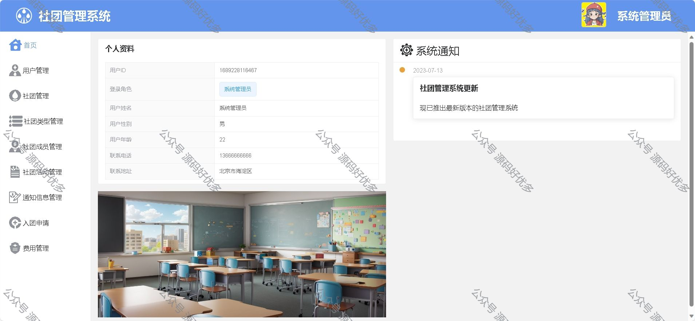
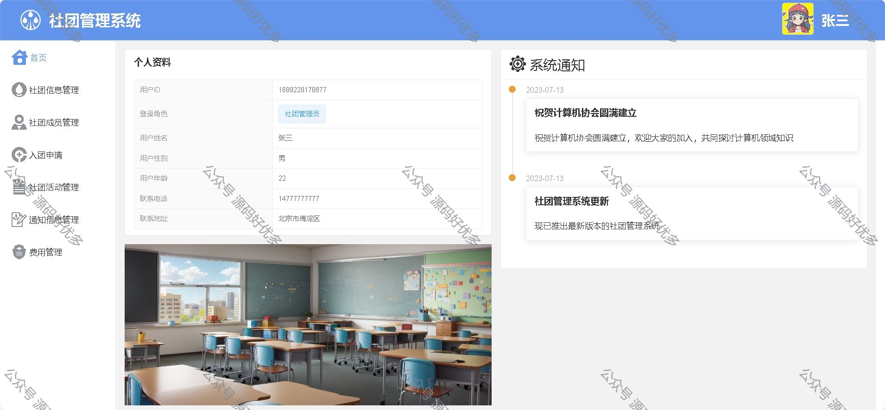
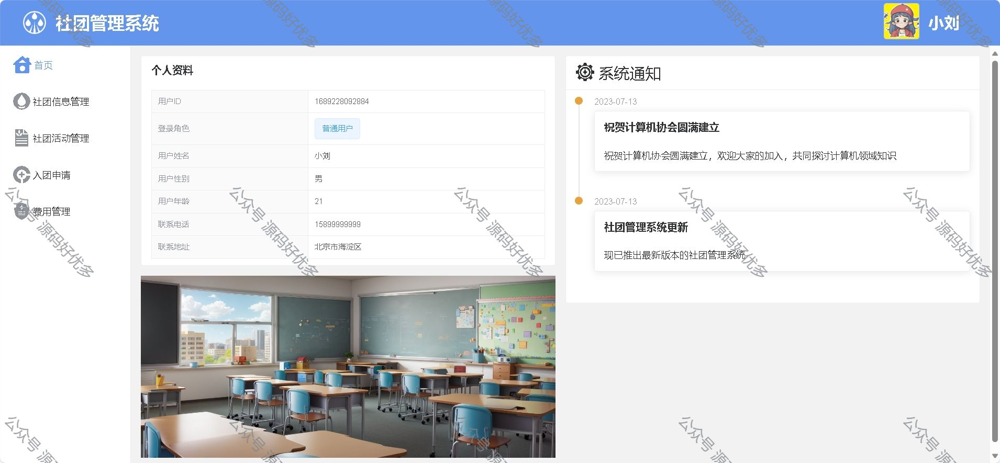
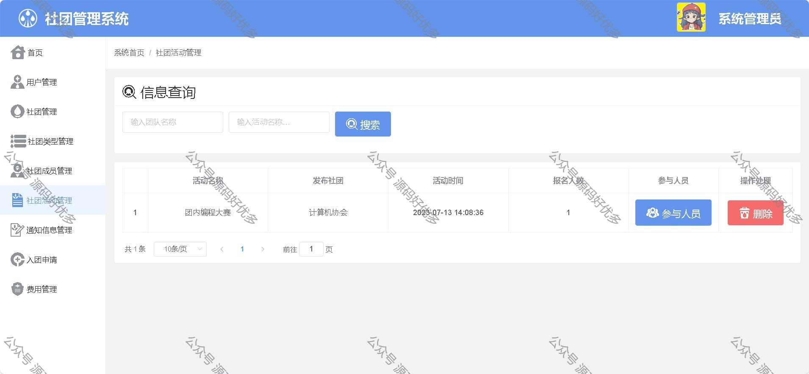
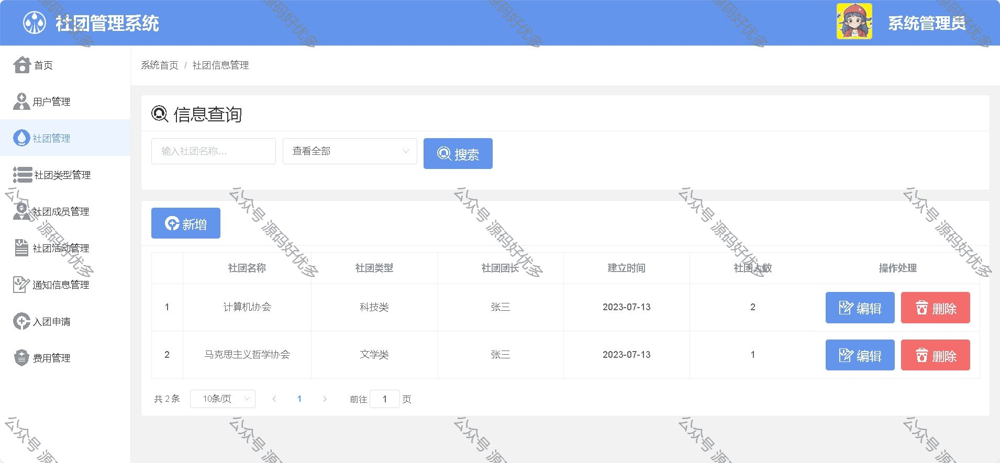
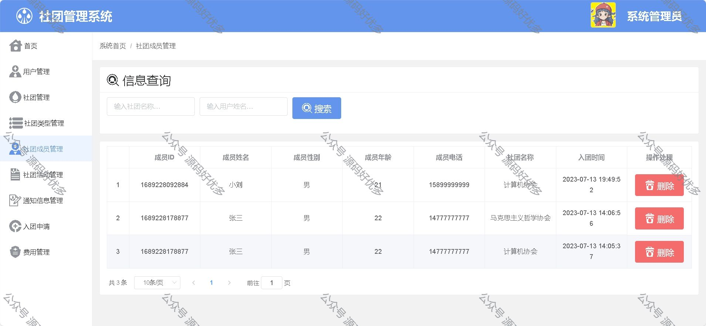
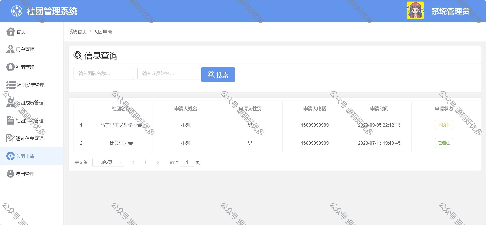
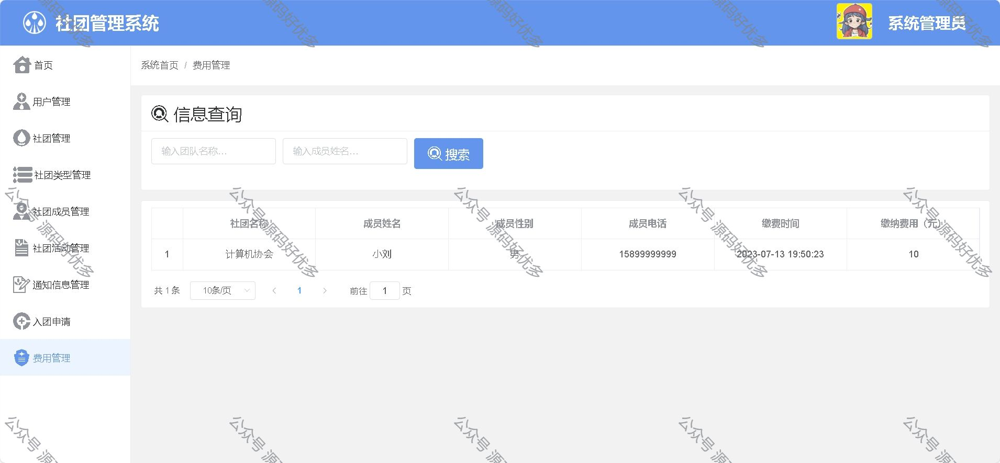
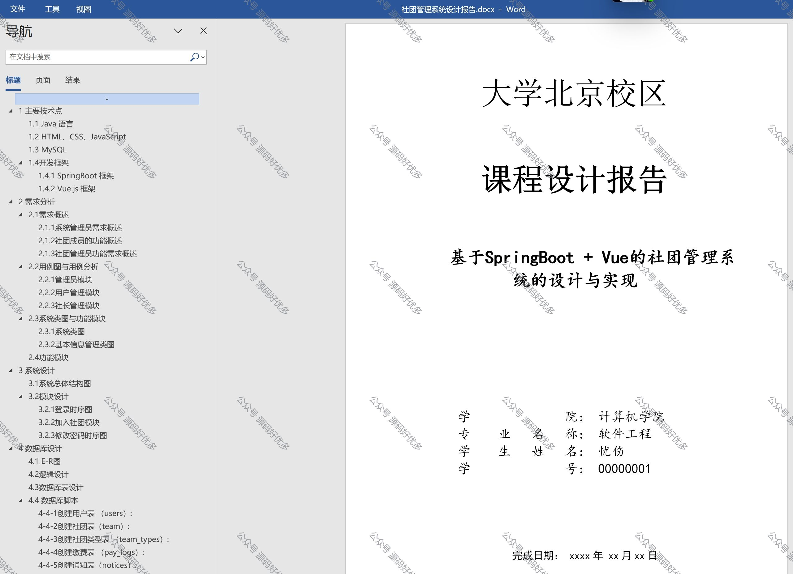

### 一、作品包含

源码+数据库+设计文档+全套环境和工具资源+部署教程

### 二、项目技术

前端技术：Html、Css、Js、Vue、Element-ui

数据库：MySQL

后端技术：Java、Spring Boot、MyBatis

### 三、运行环境

开发工具：IDEA/eclipse

数据库：MySQL8.0

数据库管理工具：Navicat10以上版本

环境配置软件： JDK1.8+Maven3.6.3

前端Nodejs：16

### 四、项目介绍

项目编号：springbootA009
在高校信息化的背景下，本系统通过对社团管理的需求与运行流程进行分析，设计了基于 Web 的社团管理系统，让繁琐的社团事务简单化，大大减轻了社团指导教师和活动组织者的负担，节约了老师和学生的时间与精力，并提高了学校管理工作的效率与质量。通过网站管理社团信息利于提高社团的形象，设计本网站旨在社团管理的安全性，方便管理者和学生的使用.通过计算机对社团管理，既能方便社团网站使用者，缩短时间，又有利于降低成本、强化内部管理、提高社团形象
系统管理员的功能概述：
三个角色：超级管理员，普通管理员和普通用户

超级管理员：
首页，用户管理，社团管理，社团类型管理，社团成员管理，社团活动管理，通知信息管理，入团申请，费用管理

普通管理员：
首页，社团信息管理，社团成员管理，入团申请，社团活动管理，通知信息管理，费用管理

普通用户：
首页，社团信息管理，社团活动管理，入团申请，费用管理
另外还有登陆，注册，修改个人信息，修改密码

### 五、运行截图

